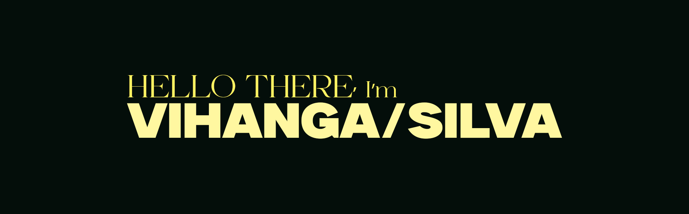

  
  
  

---

# 👩‍💻 GIT:WHOAMI

#### I'm Vihanga R. De Silva, A <b>Full-Stack Developer</b> specializing TypeScript based Frameworks such as NextJS, NodeJS, React-Native & Deno. Im working on building performant, scalable Web & Mobile applications with cutting edge technologies and Well-Managed software architectures.

# 💻 Tech Stack

## 📫 How to reach me

- 📧 Email: contact@vihanga.live
- 💼 LinkedIn: [iamvihangasilva](https://www.linkedin.com/in/iamvihangasilva/)
- 🌐 Website: [vihanga.live](https://vihanga.live)

---

  

  

