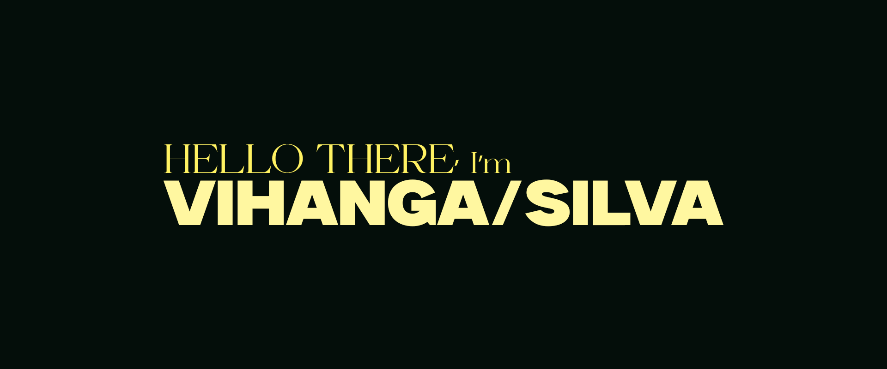

  
  
  

---

<h3 style="color: #f5f56e; font-weight: 800; font: Inter;">FULL-STACK DEVELOPMENT & SOFTWARE ENGINEERING</h3>

I'm a passionate Full-Stack Developer specializing in Next.js and Node.js. I love building performant, scalable web applications with modern technologies.

